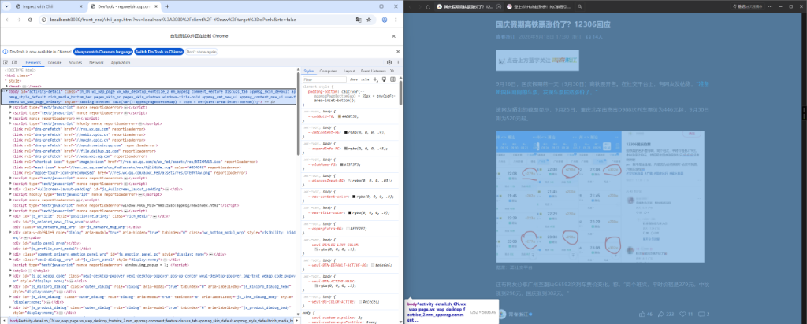
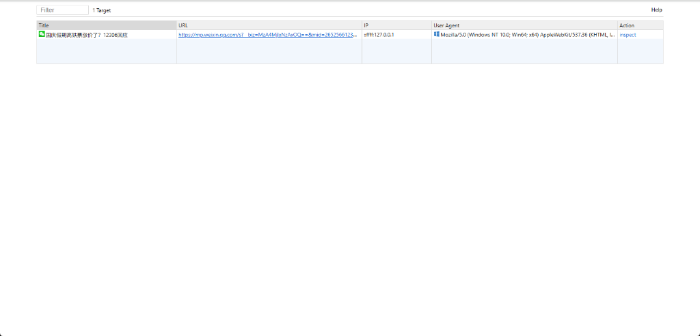
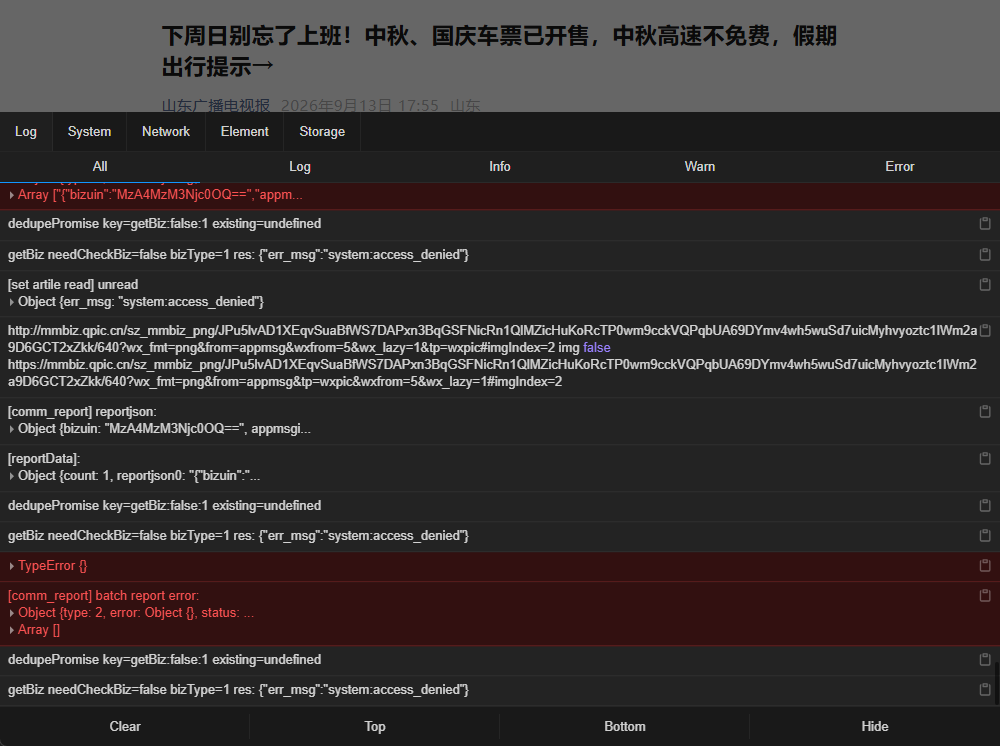
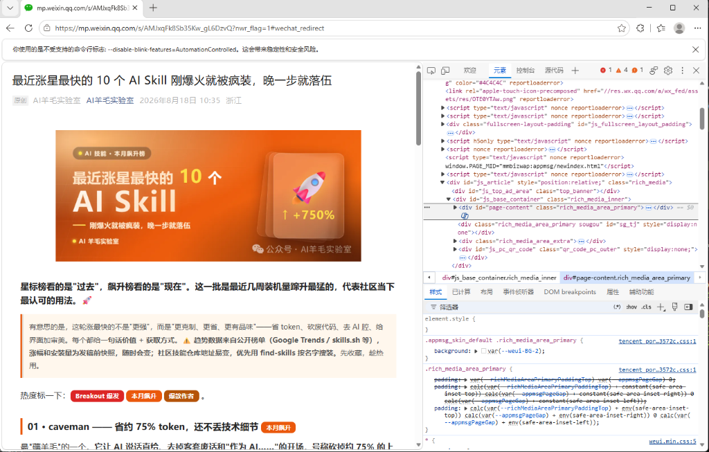
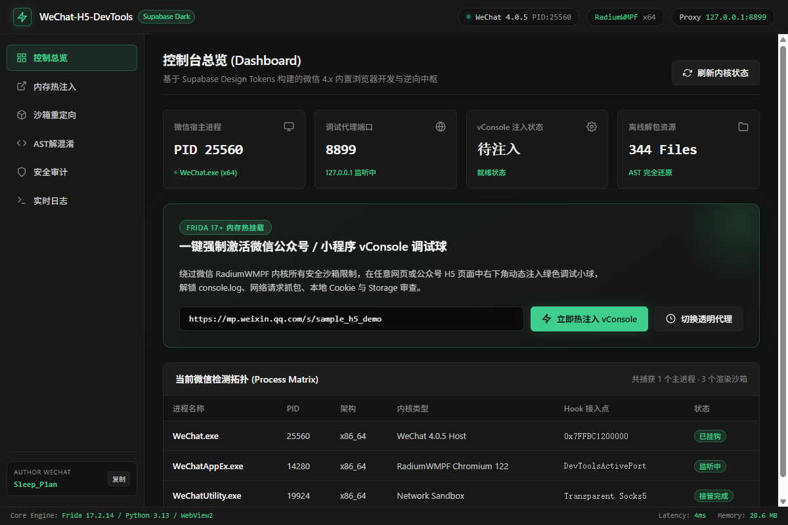

<div align="center">


# WeChat-H5-DevTools

**微信电脑版内置网页、公众号推文与小程序的前端排版与调试工具箱**

[](https://www.python.org/)
[](https://nodejs.org/)
[](https://creativecommons.org/licenses/by-nc-sa/4.0/)
[](https://frida.re/)
[](https://github.com/)

[快速上手](#快速上手) · [实测效果](#实测效果) · [调试模式](#调试模式) · [小程序调试](#小程序调试) · [常用命令](#常用命令) · [常见问题](#常见问题) · [赞助支持](#赞助支持) · [交流群](#交流群) · [免责声明](#免责声明)

</div>

---

<a id="项目背景"></a>
## 这个工具能帮你做什么？

微信升级到 4.x 以后，在电脑上打开公众号文章或网页，按键盘 F12 没反应了，鼠标右键也找不到“检查”菜单；要是复制链接到外部浏览器打开，又老是提示“请在微信客户端打开”。

**WeChat-H5-DevTools** 就是为了解决这个麻烦而生的：
- 不用降级微信，直接在电脑微信里就能按 F12 调网页、看控制台报错、抓包分析接口、实时修改页面样式；
- 支持在 Chrome 或 Edge 浏览器里直接弹出独立大屏审查文章；
- 支持前端代码一键抓取、AST 语法树批量解混淆、从 SourceMap 还原源码。

---

<a id="版本支持"></a>
## 实测支持的微信版本

| 微信客户端版本 | 实测验证状态 | 内核版本号 | 调试支持状态 |
| :--- | :--- | :--- | :--- |
| **微信 4.1.13.12** | 现场真机实测通过 | **25510** | 满血完美支持 |
| **微信 4.1.10.27** | 现场真机实测通过 | **25510** | 满血完美支持 |

实测说明：无论你用的是最新的微信 4.1.13.12 还是降级稳定版 4.1.10.27，本工具都已现场真机实测通过，安装好直接就能用。如需下载微信历史安装包，请查看 [微信版本指引与归档索引](docs/wechat_versions.md)。

---

<a id="快速上手"></a>
## 快速上手

### 1. 两步安装环境

#### 第一步：安装 Python 依赖（推荐 Python 3.9 ~ 3.12）
```bash
git clone https://github.com/markx520/WeChat-H5-DevTools.git
cd WeChat-H5-DevTools

# 安装核心依赖
pip install -r requirements.txt

# 将命令行工具注册到当前环境
pip install -e .
```

#### 第二步：安装大屏审查辅助依赖（Node.js 18+）
```bash
# 在项目根目录下执行，安装解混淆与大屏辅助脚本
npm install
```

使用技巧：如果电脑没有配置 Python 环境变量，可以在项目目录下直接运行 `python -m wechat_h5_devtools <命令>`，效果完全一样。

---

<a id="实测效果"></a><a id="调试模式"></a>
## 微信文章与网页调试：四大实用玩法

### 玩法 1：文章独立大屏审查（最常用，推荐）
运行下面这行命令，然后在电脑微信里打开任意一篇或多篇公众号文章，浏览器会自动弹出一模一样的原装开发者工具大屏：
```bash
wx-h5 article
```

<div align="center">



*微信文章窗口与开发者工具大屏联动，支持实时改样式、看控制台与抓包*

<br>



*微信里同时打开多篇文章时，后台会自动生成每一篇文章的独立审查入口*

</div>

<br>

### 玩法 2：文章就地弹出绿色调试按钮
运行命令后，在电脑微信里打开推文，点击右上角三个点并选择“刷新”，文章右下角就会出现绿色的调试按钮：
```bash
wx-h5 proxy
```

<div align="center">

|  |  |
| :---: | :---: |
| 文章右下角自动浮现调试按钮 | 点击展开完整控制台与抓包信息 |

</div>

<br>

### 玩法 3：微信内直接按键盘 F12
运行命令后，在微信里点开推文或网页，直接按下键盘上的 F12 键即可原地展开调试控制台：
```bash
wx-h5 browser
```

<div align="center">



*微信内置页面中直接按键盘 F12 呼出控制台*

</div>

<br>

### 玩法 4：桌面图形控制台（小白首选，点点鼠标就能用）
不想敲命令的朋友可以直接打开图形界面，界面上能设置微信路径、点按钮调试推文、一键解混淆代码：
```bash
wx-h5 gui
```

<div align="center">



*桌面图形控制台：一键启动调试、设置微信安装路径与查看日志*

</div>

---

<a id="小程序调试"></a>
## 微信小程序调试方法

电脑端微信小程序运行在独立的内核中，按以下三步即可调出开发者工具：

1. **第一步（启动调试通道）**：
   在命令行运行：
   ```bash
   wx-h5 open
   ```
2. **第二步（微信打开小程序）**：
   在电脑微信中正常点开你要调试的小程序；
3. **第三步（浏览器直连审查）**：
   打开 Chrome 浏览器访问 `chrome://inspect`（Edge 访问 `edge://inspect`），点击 Configure 加上 `localhost:62000`，在页面下方找到小程序名称点击蓝色的 `inspect` 链接，就能弹出原生开发者工具开始排查。

---

<a id="常用命令"></a>
## 常用命令行速查表

| 命令 | 作用说明 | 常用参数与示例 |
| :--- | :--- | :--- |
| `wx-h5 gui` | 打开桌面图形操作界面 | `wx-h5 gui` |
| `wx-h5 article` | 启动微信文章独立大屏审查 | `wx-h5 article` |
| `wx-h5 proxy` | 启动文章右下角绿色调试按钮代理 | `wx-h5 proxy --port 8899` |
| `wx-h5 browser` | 开启微信内直接按 F12 调试 | `wx-h5 browser` |
| `wx-h5 open` | 启动小程序与原生内核调试通道 | `wx-h5 open`<br>`wx-h5 open <文章链接> --sandbox` (外部沙箱双开) |
| `wx-h5 doctor` | 检查本机微信、浏览器与环境是否正常 | `wx-h5 doctor` |
| `wx-h5 dump` | 抓取文章网页的全套前端文件 | `wx-h5 dump "https://..." -o ./site -d` |
| `wx-h5 deobfuscate` | 批量解混淆前端 JavaScript 源码 | `wx-h5 deobfuscate ./site -a` |
| `wx-h5 restore` | 从 SourceMap 还原原始 Vue 与 TypeScript 代码 | `wx-h5 restore ./site` |
| `wx-h5 scan` | 静态扫描提取接口与安全审计 | `wx-h5 scan ./site -e report.md` |

---

<a id="常见问题"></a>
## 常见问题排查

1. **微信安装路径不是默认目录，软件找不到微信怎么办？**
   在桌面图形界面（`wx-h5 gui`）顶部直接点击“微信路径设置”，选好你电脑上的 `Weixin.exe` 或 `WeChat.exe` 即可自动永久保存，无需改动任何代码。
2. **提示已有微信进程在运行？**
   微信更新或调试时可能残留后台渲染进程，在任务管理器里结束掉微信，或者运行 `wx-h5 hook` 重新拉起即可。
3. **为什么复制链接在外部浏览器打不开？**
   直接使用沙箱命令 `wx-h5 open "<文章链接>" --sandbox`，工具会自动模拟微信环境并双开 F12，免除在微信客户端内点击。
4. **遇到其他疑难报错？**
   请移步查阅完整的排障全书：[docs/FAQ.md](./docs/FAQ.md)。

---

<a id="赞助支持"></a>
## 赞助与支持

如果本项目在日常开发中切实帮到了您，欢迎赞助支持本项目的持续维护：

<div align="center">

|  |  |
| :---: | :---: |
| 支付宝 | 微信支付 |

</div>

### 赞助名单

感谢以下朋友对本项目的赞助与支持：

| 微信名称 | 赞助金额 |
| :--- | :--- |
| EATMANS | 50.00 元 |
| abc | 28.88 元 |
| w. | 10.00 元 |
| 若寂梵 | 1.00 元 |
| Yuan. | 0.02 元 |

---

<a id="交流群"></a>
## 官方技术交流群

欢迎加入官方微信群交流前端调试与排版技术：

<div align="center">


<br>

入群方式：微信扫码即可进群；若二维码失效，可添加作者微信 **`Sleep_Plan`** 并备注“DevTools 入群”。

</div>

---

<a id="作者与联系方式"></a>
## 作者与联系方式

- **作者 / 核心开发者**：**markx520**
- **官方微信 (推荐首选)**：`Sleep_Plan`
- **官方邮箱**：`2603066228@qq.com`
- **GitHub 主页**：[@markx520](https://github.com/markx520)
- **项目开源仓库**：[WeChat-H5-DevTools](https://github.com/markx520/WeChat-H5-DevTools)

---

<a id="开源鸣谢"></a>
## 开源引用与鸣谢

本项目遵循开源社区技术诚信准则，在研发过程中深度借鉴并使用了以下优秀开源项目，特此致谢：
- **Frida**（动态插桩框架）
- **vConsole**（移动端调试面板）
- **Eruda**（移动端控制台）
- **WebCrack**（AST 反混淆解包引擎）
- **Mitmproxy**（网络代理中间件）
- **PyWebView**（轻量级桌面 GUI 容器）

---

<a id="免责声明"></a>
## 免责声明

1. **使用目的与技术范围**：本项目仅供前端网页开发者、排版设计人员及安全技术人员在合法合规的前提下进行技术调试、排版优化与代码审计。
2. **免责条款与风险自负**：使用者在操作过程中应严格遵守法律法规与平台服务条款，因不当使用所引发的任何风险与责任均由使用者自行承担，与本项目及开发者无关。
3. **知识产权与商标声明**：本项目中涉及的第三方商标与名称归其各自所有权人所有，项目仅作兼容性说明，不代表任何官方背书。
4. **免费开源与禁止倒卖**：本项目完全免费开源，遵循 [CC BY-NC-SA 4.0](./LICENSE) 协议，严禁任何个人或组织将其打包收费或用于商业倒卖。
